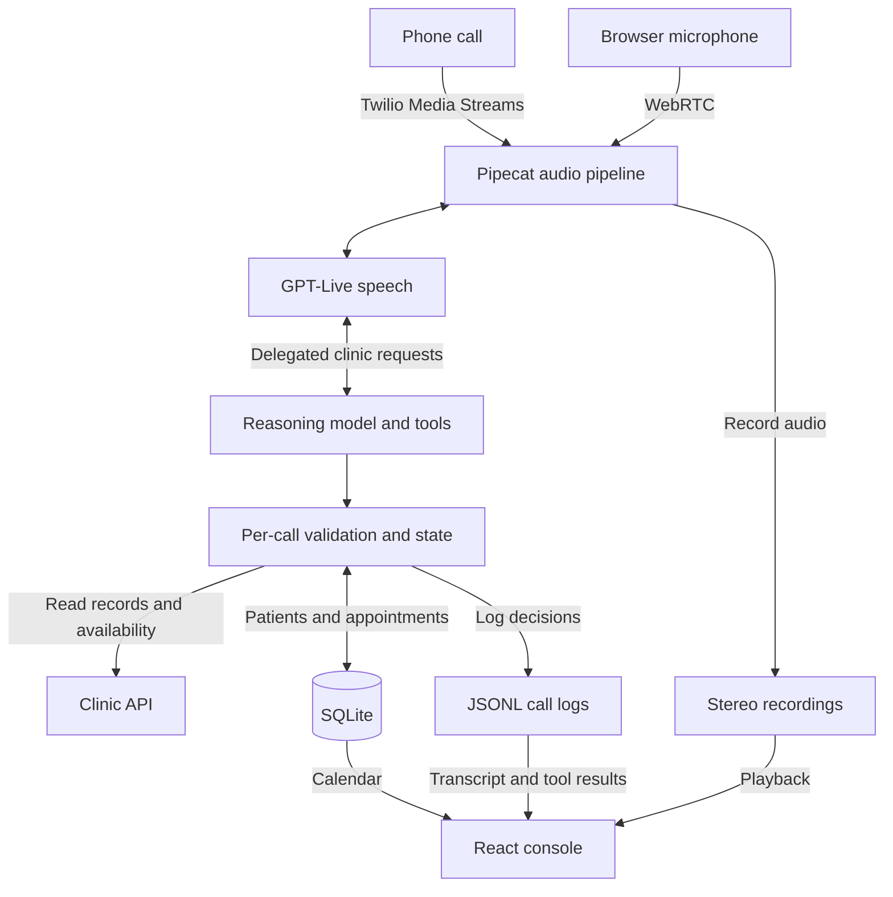

<p align="center">
  <picture>
    <source media="(prefers-color-scheme: dark)" srcset=".github/assets/rosario-logo-dark.svg">
    
  </picture>
</p>

<p align="center">
  <a href="#architecture"></a>
  <a href="#architecture"></a>
  <a href="#architecture"></a>
</p>

---

Rosario is a voice receptionist for clinics. It answers phone and browser calls, identifies patients, searches available appointments and saves confirmed bookings, changes and cancellations. It speaks Spanish, Catalan, Galician, Basque and English. A companion console lets staff review calls, inspect decisions and see the appointments Rosario saved.

[Website](https://rosario.fyi) · [Quickstart](#run-locally) · [Architecture](#architecture) · [Call review](#call-review) · [GitHub](https://github.com/luisgonzaleznf/hackspain-prosper-2026)

## Handling a call

A caller can ask for a particular doctor, choose a clinic site, describe a time in ordinary language or request several appointments. Rosario looks up the patient and searches the clinic's availability before offering a slot. When details match several people, it asks follow-up questions. When a clinic rule prevents the booking, it explains the restriction instead of inventing an appointment.

Confirmed registrations and appointment changes persist locally during the call. A new patient can register and book in the same conversation. If the caller changes their mind, Rosario uses the saved appointment to move or cancel it. Later calls see those changes, and local bookings block overlapping slots.

Rosario can also handle a relative calling for someone else, explain that no eligible slot is available or record that a medical request needs human attention. It does not diagnose or provide treatment advice.

## Architecture

The backend separates speech from clinic operations. Pipecat carries audio between the caller and GPT-Live. The voice model delegates clinic requests to a reasoning model, which calls the patient, availability and appointment tools. Both the Twilio and browser entry points use the same local session and clinic logic.



`LocalCallSession` checks identity and confirmation before a write. It requires a full name plus a matching second identifier before using a patient's calendar, rejects appointments outside the call's lookup evidence and rechecks availability before booking or moving a slot. A successful write returns `persisted=true`; the agent must wait for that result before saying the change is saved.

`LocalClinic` combines live clinic API responses with local patient and appointment records. `LocalStore` persists those changes in SQLite, so they survive a restart. Local writes do not modify the upstream clinic. Cancelling an upstream appointment locally does not release its upstream availability, and insurance authorization for a newly registered patient's specialist visit may need staff verification.

Each call also produces JSONL events and a stereo recording, with the caller and agent on separate channels. A separate FastAPI console server exposes the call records and local calendar. The React frontend reads those APIs through Vite proxies and derives the transcript and decision timeline from the events.

| Code | Responsibility |
| --- | --- |
| [backend/app/server.py](backend/app/server.py) and [backend/integrations/twilio.py](backend/integrations/twilio.py) | Phone webhook, media connection and call lifecycle. |
| [backend/app/demo/](backend/app/demo/) | Browser audio sessions, saved rehearsals and voice settings. |
| [backend/app/voice/gptlive/](backend/app/voice/gptlive/) | Speech connection and delegation to the reasoning model. |
| [backend/integrations/local_session.py](backend/integrations/local_session.py) | Per-call identity checks, confirmation and validated writes. |
| [backend/integrations/local_clinic.py](backend/integrations/local_clinic.py) and [local_store.py](backend/integrations/local_store.py) | Clinic reads, local patients and persistent appointments. |
| [backend/app/dashboard.py](backend/app/dashboard.py) and [frontend/](frontend/) | Call-review API, calendar and console UI. |

## Call review

<p align="center">
  
</p>

The overview shows call volume, booking reports, call duration and measured response gaps. Open a call for its transcript, recording and tool results. Selecting a message seeks the recording; selecting a tool marker opens its inputs and result. Raw events remain available when the summary is not enough.

The calendar shows saved appointments. The browser Studio at `/demo/` lets you choose a caller role, speak to Rosario through a microphone and review the call afterward. Voice settings offer nine samples, an English or Spanish opening and optional tone guidance. Saved settings apply to new Studio calls without changing active calls or earlier recordings.

The console can also browse an imported recording archive. The screenshot shows archived development calls, not live activity. The separate `/talk` page plays recordings or previews the microphone; it does not place a call.

## Run locally

Use Python 3.12 or newer, `uv`, Node.js 24 and pnpm. Clone the repository and create the ignored environment file:

```sh
git clone https://github.com/luisgonzaleznf/hackspain-prosper-2026.git rosario
cd rosario
cp backend/.env.example .env
```

Set `PLATFORM_API_KEY` for clinic access and `OPENAI_API_KEY` for the configured GPT-Live and reasoning models. Keep both on the server.

Start the browser voice backend:

```sh
cd backend
uv sync --frozen
uv run --project . --env-file ../.env python -m app.demo.bot --host 127.0.0.1 --port 7860
```

In another terminal, from `backend/`, start the call and calendar API:

```sh
make console CONSOLE_PORT=8001
```

Then start the frontend from `frontend/`:

```sh
pnpm install --frozen-lockfile
ROSARIO_CLINIC_API=http://127.0.0.1:8001 pnpm dev --host 127.0.0.1
```

Open [localhost:5173/demo/](http://localhost:5173/demo/) to speak to Rosario, [localhost:5173/calls](http://localhost:5173/calls) to review calls or [localhost:5173/calendar](http://localhost:5173/calendar) to see saved appointments. Allow microphone access when the browser asks.

The frontend proxies voice sessions to port 7860 by default. Set `ROSARIO_DEMO_API` if the voice backend runs elsewhere. `ROSARIO_CLINIC_API` selects the calendar and call server; `ROSARIO_CALLS_API` can override the call server separately. Both backend processes must use the same `LOCAL_CLINIC_DB` if you override its default path. Keep that database to retain patients and appointments across restarts.

For inbound phone calls, follow the [Twilio setup](backend/integrations/README.md). The [browser demo documentation](backend/app/demo/README.md) covers saved recordings and session review.

## Email

With Resend enabled, Rosario can send an appointment summary after the caller spells and confirms an email address. It sends the final appointment details after hang-up, excluding bookings that were moved or cancelled earlier in the call. Callers can also consent to a customer record and a welcome email. That customer record is separate from the clinic patient profile and does not create a login.

Email is off by default and needs a verified sender domain. The [email setup](backend/docs/appointment-email.md) covers configuration, consent and delivery status. Demo messages are labelled as such.

## Current limits

The included clinic integration uses synthetic data, and saved appointments belong to Rosario's local database. This is a supervised demo, not a deployed medical service. Identity checks do not replace a complete authorization system, and a recorded escalation does not connect the caller to a clinician.

The demo endpoints and review URLs do not require a login, and the Twilio integration does not validate request signatures. Keep tunnels limited to supervised calls; an exposed endpoint can incur model and email charges. Use only volunteered demo email addresses, and keep credentials, databases and call recordings out of Git.
