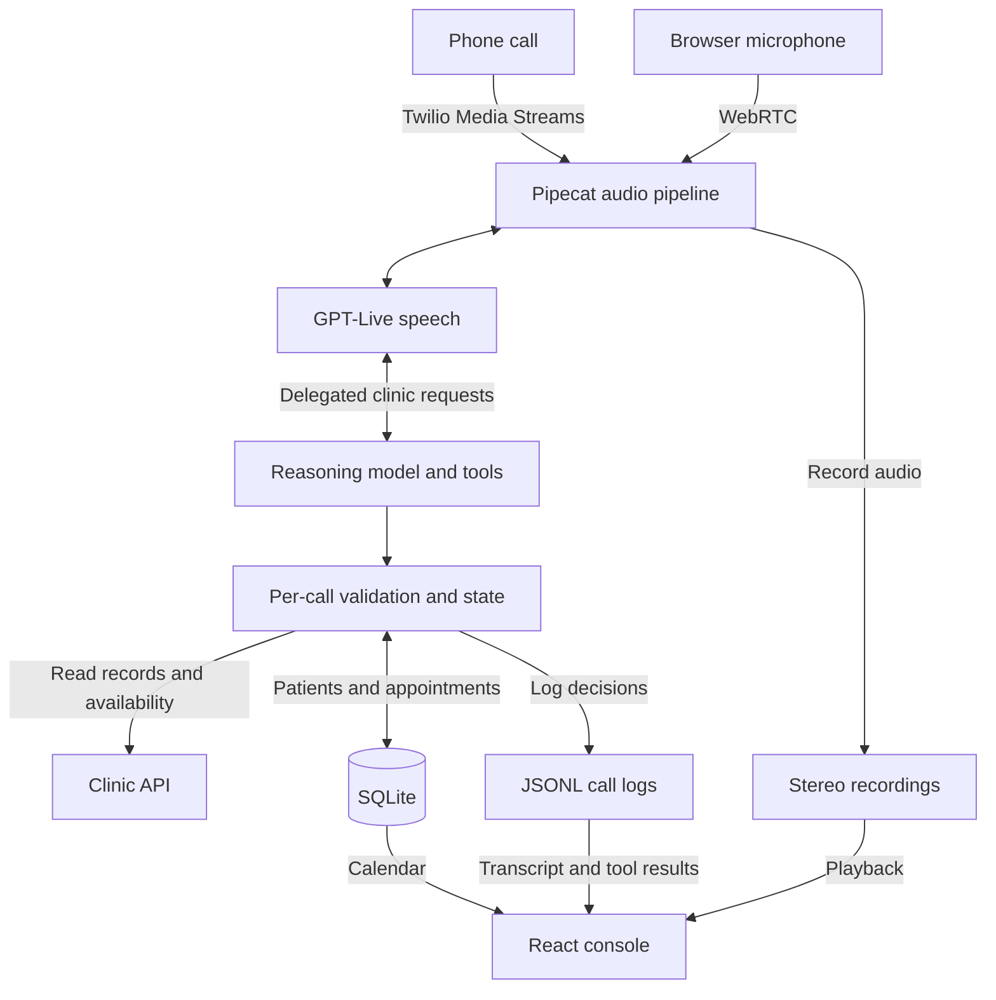
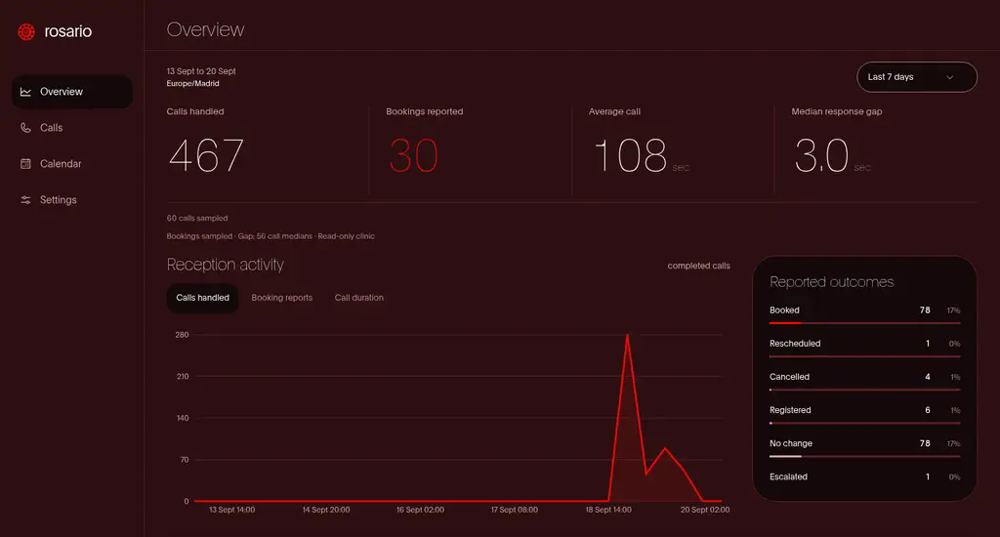

<p align="center">
  <picture>
    <source media="(prefers-color-scheme: dark)" srcset=".github/assets/rosario-logo-dark.svg">
    
  </picture>
</p>

<p align="center">
  <a href="https://rosario.fyi"></a>
  <a href="#architecture"></a>
  <a href="#architecture"></a>
</p>

---

Rosario is a voice receptionist for clinics. It answers phone and browser calls, identifies patients, searches available appointments and saves confirmed bookings, changes and cancellations. Powered by GPT-Live, it follows the caller's language and can switch languages during a call. A companion console lets staff review calls, inspect decisions and see the appointments Rosario saved.

[Website](https://rosario.fyi) · [Quickstart](#run-locally) · [Architecture](#architecture) · [Call review](#call-review) · [GitHub](https://github.com/luisgonzaleznf/hackspain-prosper-2026)

## Handling a call

A caller can ask for a particular doctor, choose a clinic site, describe a time in ordinary language or request several appointments. Rosario looks up the patient and searches the clinic's availability before offering a slot. When details match several people, it asks follow-up questions. When a clinic rule prevents the booking, it explains the restriction instead of inventing an appointment.

Confirmed registrations and appointment changes persist locally during the call. A new patient can register and book in the same conversation. If the caller changes their mind, Rosario uses the saved appointment to move or cancel it. Later calls see those changes, and local bookings block overlapping slots.

Rosario can also handle a relative calling for someone else, explain that no eligible slot is available or record that a medical request needs human attention. It does not diagnose or provide treatment advice.

## Functionalities

- **Patient registration:** Save new patient profiles during a call and use them to book immediately. Profiles remain available on later calls.
- **Appointment management:** Book, move and cancel confirmed appointments, with a shared calendar that persists across calls and restarts.
- **Audio and transcription tracking:** Save recordings, transcripts, tool inputs and results, and a decision timeline for each call. Staff can replay conversations and inspect how Rosario reached an outcome.
- **Email and customer records:** With Resend enabled, send final appointment summaries after hang-up to an address the caller spells and confirms. Callers can also consent to a saved customer record and welcome email; this record is separate from the clinic patient profile and does not create a login.

Email is off by default and needs a verified sender domain. The [email setup](backend/docs/appointment-email.md) covers configuration, consent and delivery status. Demo messages are labelled as such.

## Architecture

The repository has three main parts:

| Folder | Responsibility |
| --- | --- |
| [frontend/](frontend/) | React console, landing page and browser Studio: calendar, call review and voice settings. |
| [backend/](backend/) | Phone and browser voice sessions, clinic integration, persistent patient and appointment records, email and call artifacts. |
| [leaderboard/](leaderboard/) | The scored agent and evaluation harness we used to win the HackSpain Prosper track against 11 other teams. |

The backend separates speech from clinic operations. Pipecat carries audio between the caller and GPT-Live. The voice model delegates clinic requests to a reasoning model, which calls the patient, availability and appointment tools. Both the Twilio and browser entry points use the same local session and clinic logic.



The backend checks identity, caller confirmation and availability before saving appointment changes in SQLite. A separate FastAPI server gives the console access to the local calendar, call logs and recordings. See the [integration docs](backend/integrations/README.md) for implementation details.

## Call review

<p align="center">
  
</p>

The overview shows call volume, booking reports, call duration and measured response gaps. Open a call for its transcript, recording and tool results. Selecting a message seeks the recording; selecting a tool marker opens its inputs and result. Raw events remain available when the summary is not enough.

The calendar shows saved appointments. The browser Studio at `/demo/` lets you choose a caller role, speak to Rosario through a microphone and review the call afterward. Voice settings offer nine samples, an English or Spanish opening and optional tone guidance. Saved settings apply to new Studio calls without changing active calls or earlier recordings.

The console can also browse an imported recording archive. The screenshot shows archived development calls, not live activity. The separate `/talk` page plays recordings or previews the microphone; it does not place a call.

## Run locally

Use Python 3.12 or newer, `uv`, Node.js 24 and pnpm. Clone the repository and create the ignored environment file:

```sh
git clone https://github.com/luisgonzaleznf/hackspain-prosper-2026.git rosario
cd rosario
cp backend/.env.example .env
```

Set `PLATFORM_API_KEY` for clinic access and `OPENAI_API_KEY` for the configured GPT-Live and reasoning models. Keep both on the server.

Start the browser voice backend:

```sh
cd backend
uv sync --frozen
uv run --project . --env-file ../.env python -m app.demo.bot --host 127.0.0.1 --port 7860
```

In another terminal, from `backend/`, start the call and calendar API:

```sh
make console CONSOLE_PORT=8001
```

Then start the frontend from `frontend/`:

```sh
pnpm install --frozen-lockfile
ROSARIO_CLINIC_API=http://127.0.0.1:8001 pnpm dev --host 127.0.0.1
```

Open [localhost:5173/demo/](http://localhost:5173/demo/) to speak to Rosario, [localhost:5173/calls](http://localhost:5173/calls) to review calls or [localhost:5173/calendar](http://localhost:5173/calendar) to see saved appointments. Allow microphone access when the browser asks.

The frontend proxies voice sessions to port 7860 by default. Set `ROSARIO_DEMO_API` if the voice backend runs elsewhere. `ROSARIO_CLINIC_API` selects the calendar and call server; `ROSARIO_CALLS_API` can override the call server separately. Both backend processes must use the same `LOCAL_CLINIC_DB` if you override its default path. Keep that database to retain patients and appointments across restarts.

For inbound phone calls, follow the [Twilio setup](backend/integrations/README.md). The [browser demo documentation](backend/app/demo/README.md) covers saved recordings and session review.

## Demo

This is a hackathon demo. The included clinic integration uses synthetic data, and saved patients and appointments stay in Rosario's local database without changing the upstream clinic. It is intended for supervised demonstrations; appointments are not real medical bookings, and recorded escalations do not connect callers to a clinician.
